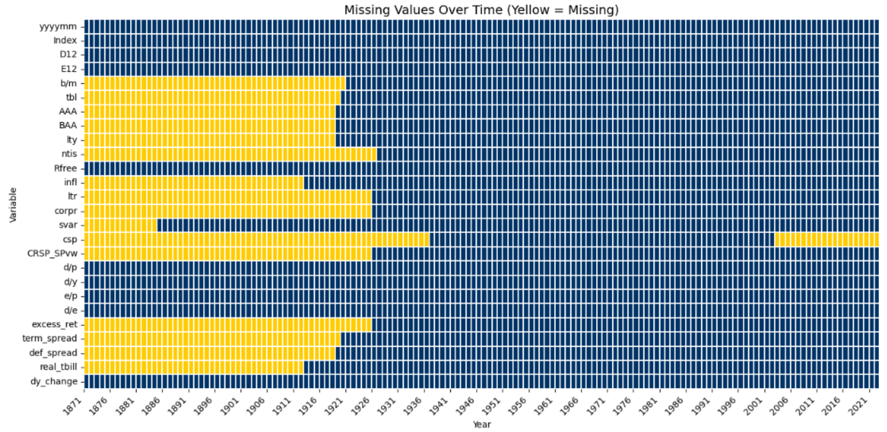
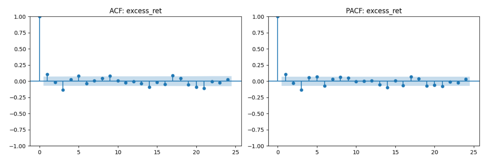
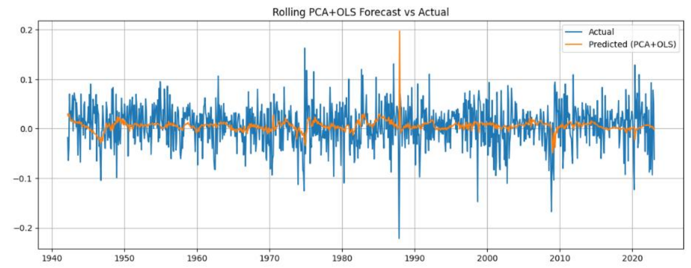
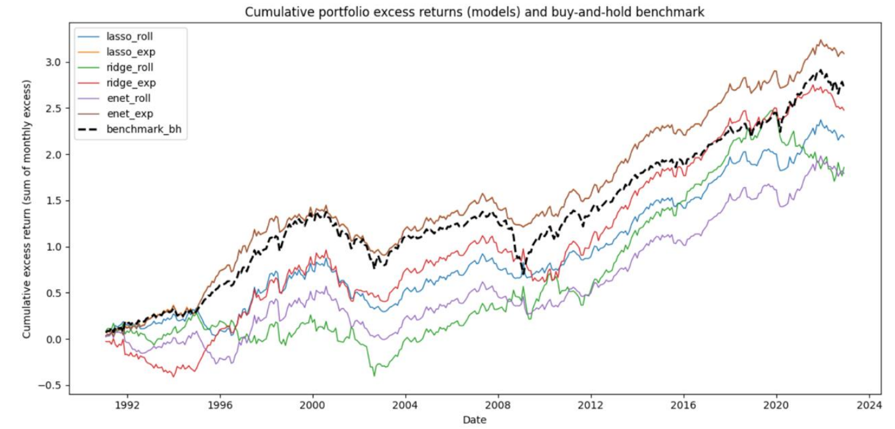
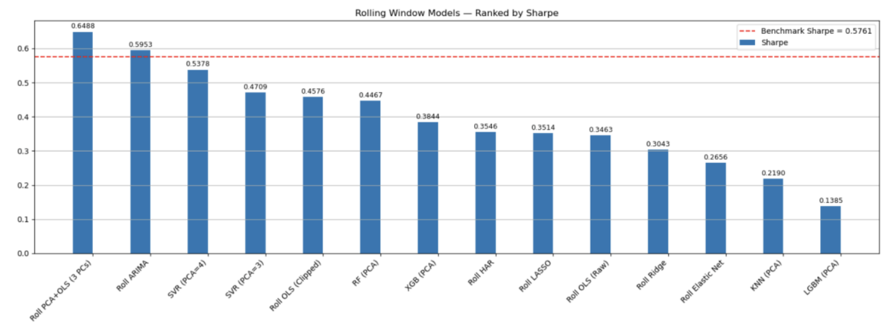
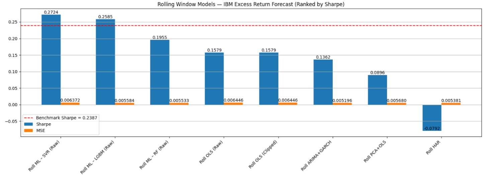

# Forecasting the Equity Premium  
*MFIN705 – Time Series Analysis*

This repository contains the full implementation, analysis, and results for a term project on **forecasting the next-month equity premium of the S&P 500** using monthly macroeconomic and valuation predictors. The project compares **econometric time-series models** and **machine learning models** under a unified backtesting framework and evaluates both **statistical accuracy** and **economic value**.

An extension applies the same methodology to **IBM stock** to highlight differences between market-level and single-stock predictability.

---

## 1. Project Motivation and Objective

Forecasting the equity premium is a central problem in empirical finance, yet the literature shows that predictability is **weak, unstable, and highly sample-dependent**.

This project aims to:
- Forecast **one-month-ahead excess returns** of the S&P 500
- Compare **traditional econometric models** with **machine learning models**
- Ensure fair comparison using **identical rolling / expanding window designs**
- Evaluate models using:
  - Out-of-sample R²
  - Forecast errors
  - Portfolio Sharpe ratios
- Extend the framework to a **single-stock case (IBM)**

The emphasis is on **economic relevance**, not in-sample fit.

---

## 2. Data and Predictor Construction

- Frequency: **monthly**
- Target variable: **equity premium** (market excess return)
- Predictors include:
  - Valuation ratios: dividend-price, dividend yield, earnings-price, payout ratio
  - Interest rate variables: term spread, default spread, real T-bill rate
  - Dividend growth measures
- All predictors are **lagged by one month** to avoid look-ahead bias
- Variable `csp` is excluded due to missing values and redundancy

---

## 3. Models Implemented

### Econometric Models
- Ordinary Least Squares (OLS)
- PCA + OLS
- ARIMA (primarily AR(1))
- ARIMA + GARCH
- HAR model

### Regularized Linear Models
- LASSO (rolling / expanding)
- Ridge (rolling / expanding)
- Elastic Net (rolling / expanding)

### Machine Learning Models
- Support Vector Regression (SVR)
- Random Forest
- XGBoost
- LightGBM (mainly used in the IBM extension)

All models are trained and evaluated under **identical assumptions**.

---

## 4. Backtesting Design

- Forecast horizon: **1 month**
- Rolling window length: **180 months (15 years)**
- Expanding window used for robustness checks
- Portfolio weights are clipped to **[-1.5, 1.5]**
- Benchmark: buy-and-hold excess return strategy
- Evaluation metrics:
  - Out-of-sample R²
  - MSE / MAE
  - Annualized Sharpe ratio

---

## 5. Empirical Results – S&P 500

### 5.1 Missing Data Diagnostics

**Missing value heatmap for predictors**

---

### 5.2 Time-Series Properties

**ACF and PACF of the equity premium**

---

### 5.3 Forecast Performance

**Forecast vs. actual excess returns (Rolling PCA + OLS)**

---

### 5.4 Economic Value of Forecasts

**Cumulative excess returns from trading strategies**

**Sharpe ratio comparison across S&P 500 strategies**

**Key findings**
- Only **three strategies outperform the benchmark Sharpe**
- Best overall performer: **Rolling PCA + OLS**
- Simple ARIMA models remain competitive
- Out-of-sample R² is negative for all models, highlighting the difficulty of equity premium prediction

---

## 6. Extension: IBM Stock

**Sharpe ratio comparison for IBM strategies**

**Key insights**
- Rolling-window models dominate expanding-window models
- Nonlinear ML models outperform linear factor models
- Volatility dynamics play a larger role at the single-stock level

---

## 7. References
-Welch, I., & Goyal, A. (2008). A comprehensive look at the empirical performance of equity premium prediction. Review of Financial Studies.
-Campbell, J. Y., & Thompson, S. B. (2008). Predicting excess stock returns out of sample. Journal of Financial Economics.
-Corsi, F. (2009). A simple approximate long-memory model of realized volatility. Journal of Financial Econometrics.
- Tools used: Python, ChatGPT, Gemini, Google Colab

##10. Disclaimer

This project is conducted strictly for academic purposes.
Results depend on data definitions, sample periods, and modeling assumptions.
This repository does not constitute investment advice or trading recommendations.